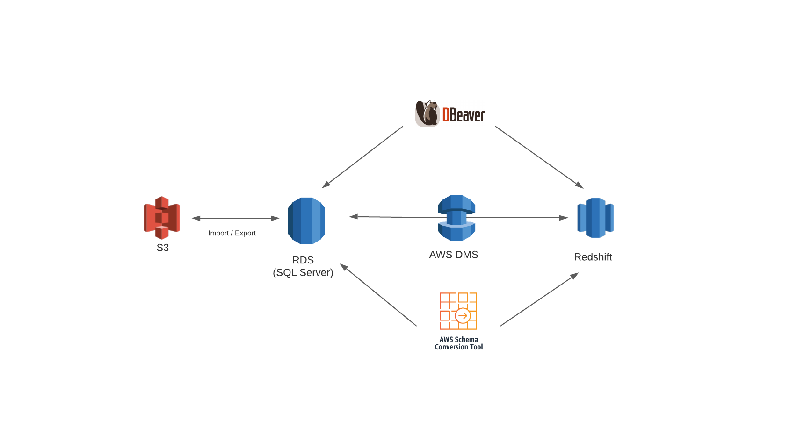

# cdk

This is a CDK script to build a demo with AWS RDS, AWS SCT (Schema Conversion Tool), AWS DMS (Database Migration Service), and Redshift. It builds 4 stacks (vpc, rds, redshift, and dms) which:

1) creates an RDS (SQL Server) instance and a Redshift cluster
2) allows connections from the Internet to RDS and Redshift through a database management tool like [DBeaver](https://dbeaver.io/). Caution: RDS and Redshift are deployed on public subnets. This is just for test purposes. It is not the best architecture for production environments.
3) configures a DMS instance, RDS and Redshift endpoints, and a migration task.

After stack creation, you can manually:

1) load data on the RDS database.
2) convert schemas from RDS to Redshift. Please, refer to [SCT installation](https://docs.aws.amazon.com/SchemaConversionTool/latest/userguide/CHAP_Installing.html).
3) start a migration task from RDS to Redshift.

# architecture

 
